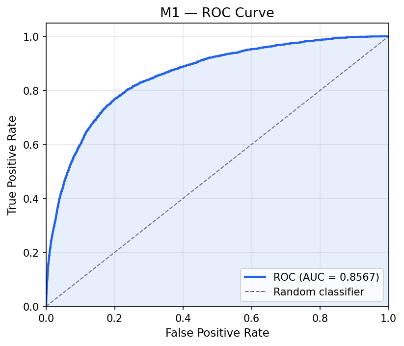
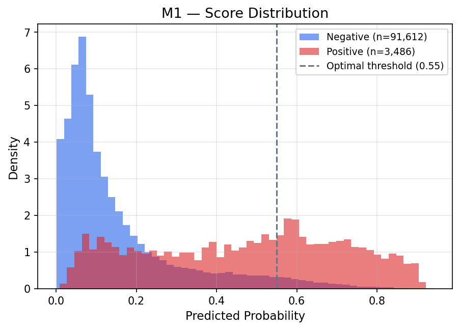
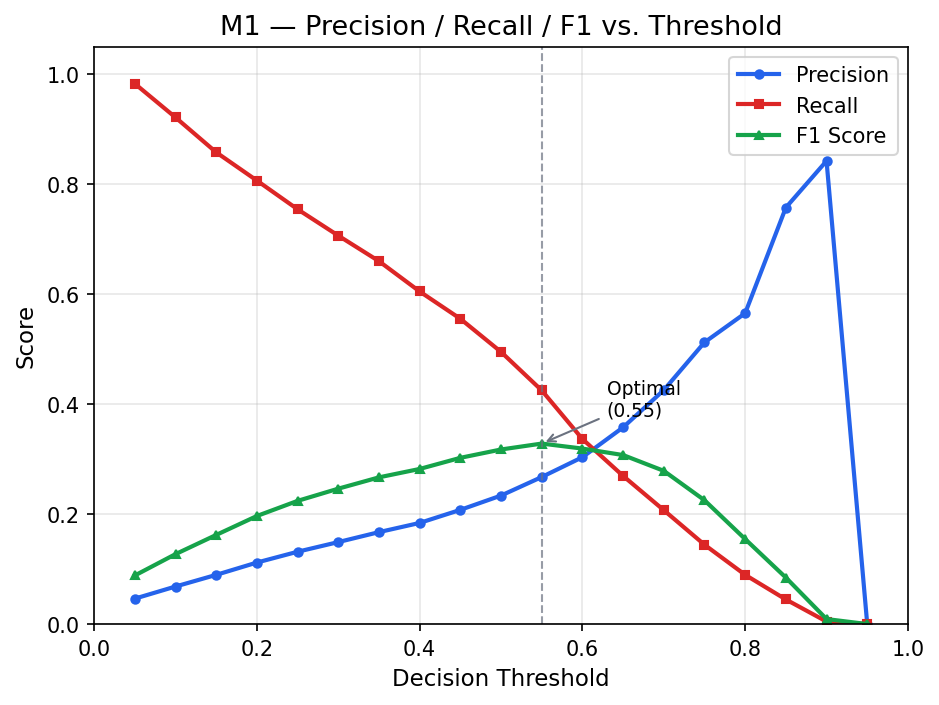
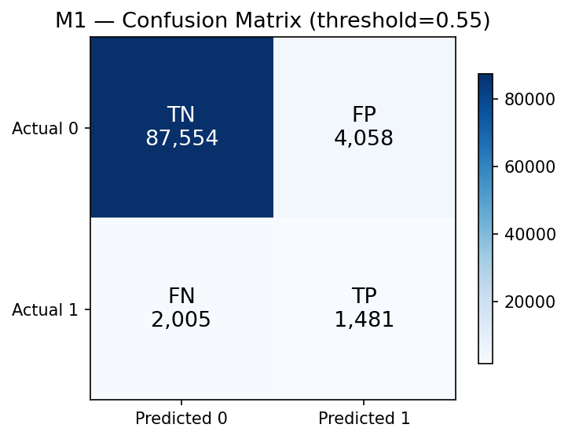
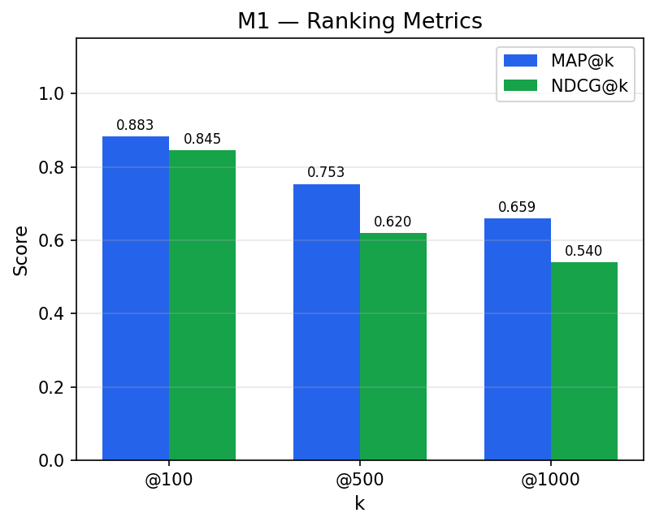
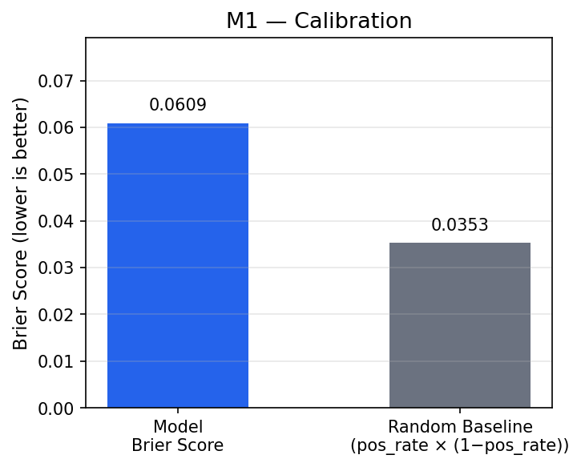

# Evaluation Report — Model M1

| Property | Value |
|----------|-------|
| Evaluation date | 2026-03-02T18:41:25.033650+00:00 |
| Test set size | 95,098 |
| Positives | 3,486 (3.67%) |
| Negatives | 91,612 (96.33%) |

---

## 1. Discrimination — ROC Curve

| Metric | Value |
|--------|-------|
| **AUC-ROC** | **0.8511** |

---

## 2. Score Distribution

---

## 3. Precision / Recall / F1 vs. Threshold

Threshold Analysis Table (click to expand)

| Threshold | Precision | Recall | F1 | TN | FP | FN | TP |
|:---------:|:---------:|:------:|:--:|---:|---:|---:|---:|
| 0.05 | 0.0459 | 0.9828 | 0.0877 | 20,406 | 71,206 | 60 | 3,426 |
| 0.10 | 0.0637 | 0.9291 | 0.1193 | 44,028 | 47,584 | 247 | 3,239 |
| 0.15 | 0.0824 | 0.8623 | 0.1504 | 58,140 | 33,472 | 480 | 3,006 |
| 0.20 | 0.1028 | 0.7992 | 0.1822 | 67,295 | 24,317 | 700 | 2,786 |
| 0.25 | 0.1257 | 0.7418 | 0.2150 | 73,630 | 17,982 | 900 | 2,586 |
| 0.30 | 0.1488 | 0.6830 | 0.2444 | 77,992 | 13,620 | 1,105 | 2,381 |
| 0.35 | 0.1717 | 0.6251 | 0.2694 | 81,101 | 10,511 | 1,307 | 2,179 |
| 0.40 | 0.1957 | 0.5691 | 0.2912 | 83,457 | 8,155 | 1,502 | 1,984 |
| 0.45 | 0.2233 | 0.5083 | 0.3103 | 85,448 | 6,164 | 1,714 | 1,772 |
| 0.50 | 0.2519 | 0.4449 | 0.3217 | 87,007 | 4,605 | 1,935 | 1,551 |
| 0.55 **←** | 0.2871 | 0.3850 | 0.3289 | 88,280 | 3,332 | 2,144 | 1,342 |
| 0.60 | 0.3336 | 0.3236 | 0.3285 | 89,359 | 2,253 | 2,358 | 1,128 |
| 0.65 | 0.3691 | 0.2467 | 0.2957 | 90,142 | 1,470 | 2,626 | 860 |
| 0.70 | 0.4321 | 0.1879 | 0.2619 | 90,751 | 861 | 2,831 | 655 |
| 0.75 | 0.5256 | 0.1357 | 0.2157 | 91,185 | 427 | 3,013 | 473 |
| 0.80 | 0.6255 | 0.0901 | 0.1575 | 91,424 | 188 | 3,172 | 314 |
| 0.85 | 0.7695 | 0.0565 | 0.1053 | 91,553 | 59 | 3,289 | 197 |
| 0.90 | 0.9524 | 0.0115 | 0.0227 | 91,610 | 2 | 3,446 | 40 |
| 0.95 | 0.0000 | 0.0000 | 0.0000 | 91,612 | 0 | 3,486 | 0 |

---

## 4. Optimal Threshold & Confusion Matrix

**Recommended operating point (F1-maximizing):** threshold = **0.55**

| Metric | Value |
|--------|------:|
| Threshold | 0.55 |
| Precision | 0.2871 |
| Recall | 0.3850 |
| F1 | 0.3289 |
| TN | 88,280 |
| FP | 3,332 |
| FN | 2,144 |
| TP | 1,342 |

---

## 5. Ranking Metrics

| Metric | Value |
|--------|------:|
| MAP@100 | 0.9576 |
| MAP@500 | 0.8264 |
| MAP@1000 | 0.7259 |
| NDCG@100 | 0.9679 |
| NDCG@500 | 0.6721 |
| NDCG@1000 | 0.5522 |

---

## 6. Calibration

| Metric | Value |
|--------|------:|
| Brier Score | 0.0598 |
| Brier Baseline (random) | 0.0353 |

> Lower Brier Score = better calibration. Baseline = positive_rate × (1 − positive_rate).

---

## 7. Training Context

**Imbalance strategy:** upsampling_25pct

**Best hyperparameters:**

| Parameter | Value |
|-----------|------:|
| colsample_bytree | 0.6654490124263246 |
| gamma | 1.0 |
| learning_rate | 0.03529746546288799 |
| max_depth | 7 |
| min_child_weight | 3 |
| n_estimators | 221 |
| reg_alpha | 0.1 |
| reg_lambda | 5 |
| subsample | 0.7806217129238506 |

---

*Report generated automatically by SIP Engine evaluation module.*  
*See companion JSON and CSV files for machine-readable data.*
