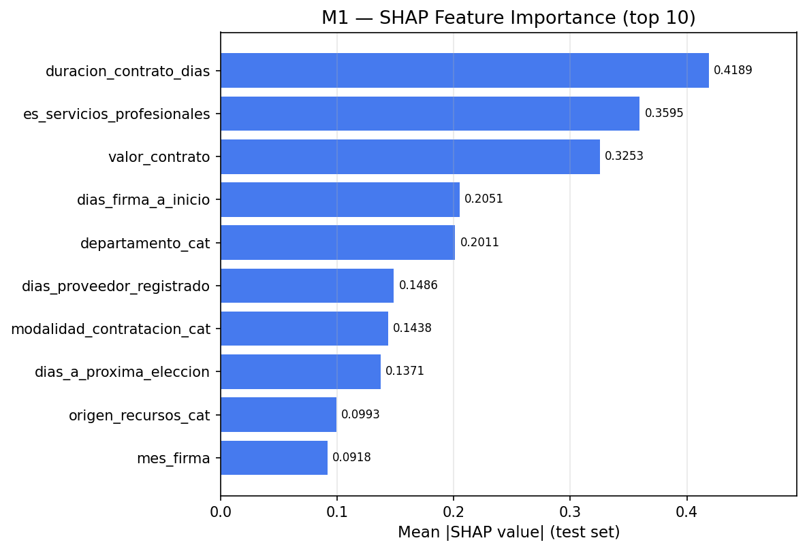

# Evaluation Report — Model M1

| Property | Value |
|----------|-------|
| Evaluation date | 2026-03-03T01:49:37.701167+00:00 |
| Test set size | 95,098 |
| Positives | 3,486 (3.67%) |
| Negatives | 91,612 (96.33%) |

---

## 1. Discrimination — ROC Curve

| Metric | Value |
|--------|-------|
| **AUC-ROC** | **0.8567** |

---

## 2. Score Distribution

---

## 3. Precision / Recall / F1 vs. Threshold

Threshold Analysis Table (click to expand)

| Threshold | Precision | Recall | F1 | TN | FP | FN | TP |
|:---------:|:---------:|:------:|:--:|---:|---:|---:|---:|
| 0.05 | 0.0463 | 0.9825 | 0.0884 | 21,032 | 70,580 | 61 | 3,425 |
| 0.10 | 0.0683 | 0.9211 | 0.1272 | 47,825 | 43,787 | 275 | 3,211 |
| 0.15 | 0.0895 | 0.8577 | 0.1621 | 61,198 | 30,414 | 496 | 2,990 |
| 0.20 | 0.1119 | 0.8064 | 0.1965 | 69,302 | 22,310 | 675 | 2,811 |
| 0.25 | 0.1315 | 0.7542 | 0.2240 | 74,256 | 17,356 | 857 | 2,629 |
| 0.30 | 0.1491 | 0.7063 | 0.2462 | 77,561 | 14,051 | 1,024 | 2,462 |
| 0.35 | 0.1672 | 0.6598 | 0.2668 | 80,156 | 11,456 | 1,186 | 2,300 |
| 0.40 | 0.1839 | 0.6047 | 0.2820 | 82,258 | 9,354 | 1,378 | 2,108 |
| 0.45 | 0.2077 | 0.5551 | 0.3023 | 84,230 | 7,382 | 1,551 | 1,935 |
| 0.50 | 0.2337 | 0.4948 | 0.3174 | 85,955 | 5,657 | 1,761 | 1,725 |
| 0.55 **←** | 0.2674 | 0.4248 | 0.3282 | 87,554 | 4,058 | 2,005 | 1,481 |
| 0.60 | 0.3034 | 0.3365 | 0.3191 | 88,919 | 2,693 | 2,313 | 1,173 |
| 0.65 | 0.3577 | 0.2694 | 0.3073 | 89,926 | 1,686 | 2,547 | 939 |
| 0.70 | 0.4255 | 0.2071 | 0.2786 | 90,637 | 975 | 2,764 | 722 |
| 0.75 | 0.5122 | 0.1443 | 0.2252 | 91,133 | 479 | 2,983 | 503 |
| 0.80 | 0.5652 | 0.0895 | 0.1545 | 91,372 | 240 | 3,174 | 312 |
| 0.85 | 0.7573 | 0.0448 | 0.0845 | 91,562 | 50 | 3,330 | 156 |
| 0.90 | 0.8421 | 0.0046 | 0.0091 | 91,609 | 3 | 3,470 | 16 |
| 0.95 | 0.0000 | 0.0000 | 0.0000 | 91,612 | 0 | 3,486 | 0 |

---

## 4. Optimal Threshold & Confusion Matrix

**Recommended operating point (F1-maximizing):** threshold = **0.55**

| Metric | Value |
|--------|------:|
| Threshold | 0.55 |
| Precision | 0.2674 |
| Recall | 0.4248 |
| F1 | 0.3282 |
| TN | 87,554 |
| FP | 4,058 |
| FN | 2,005 |
| TP | 1,481 |

---

## 5. Ranking Metrics

| Metric | Value |
|--------|------:|
| MAP@100 | 0.8833 |
| MAP@500 | 0.7529 |
| MAP@1000 | 0.6591 |
| NDCG@100 | 0.8447 |
| NDCG@500 | 0.6198 |
| NDCG@1000 | 0.5403 |

---

## 6. Calibration

| Metric | Value |
|--------|------:|
| Brier Score | 0.0609 |
| Brier Baseline (random) | 0.0353 |

> Lower Brier Score = better calibration. Baseline = positive_rate × (1 − positive_rate).

---

## 8. SHAP Feature Importance

Top features by mean absolute SHAP value (test set):

| Rank | Feature | Mean abs SHAP |
|-----:|--------|--------------:|
| 1 | duracion_contrato_dias | 0.418877 |
| 2 | es_servicios_profesionales | 0.359516 |
| 3 | valor_contrato | 0.325316 |
| 4 | dias_firma_a_inicio | 0.205119 |
| 5 | departamento_cat | 0.201150 |
| 6 | dias_proveedor_registrado | 0.148609 |
| 7 | modalidad_contratacion_cat | 0.143787 |
| 8 | dias_a_proxima_eleccion | 0.137085 |
| 9 | origen_recursos_cat | 0.099303 |
| 10 | mes_firma | 0.091774 |

SHAP artifact (parquet): shap_M1.parquet

---

## 9. Training Context

**Imbalance strategy:** upsampling_25pct

**Best hyperparameters:**

| Parameter | Value |
|-----------|------:|
| colsample_bytree | 0.6654490124263246 |
| gamma | 1.0 |
| learning_rate | 0.03529746546288799 |
| max_depth | 7 |
| min_child_weight | 3 |
| n_estimators | 221 |
| reg_alpha | 0.1 |
| reg_lambda | 5 |
| subsample | 0.7806217129238506 |

---

*Report generated automatically by SIP Engine evaluation module.*  
*See companion JSON and CSV files for machine-readable data.*
