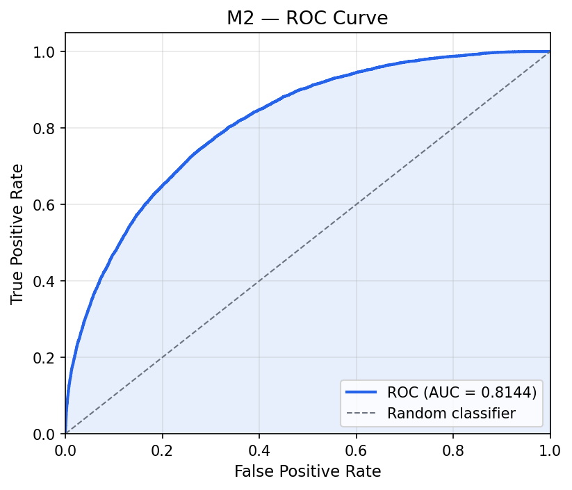
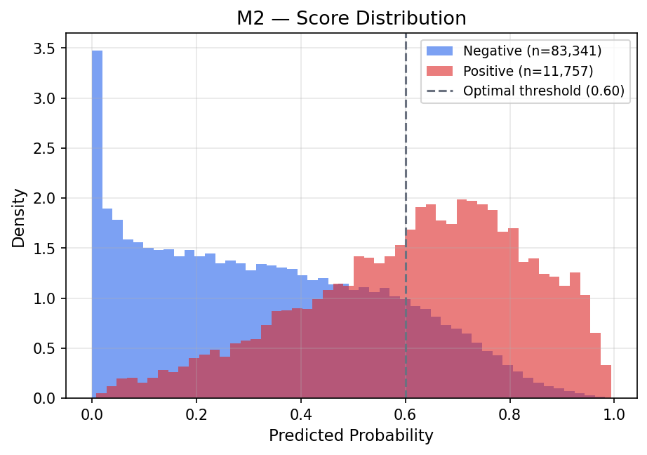
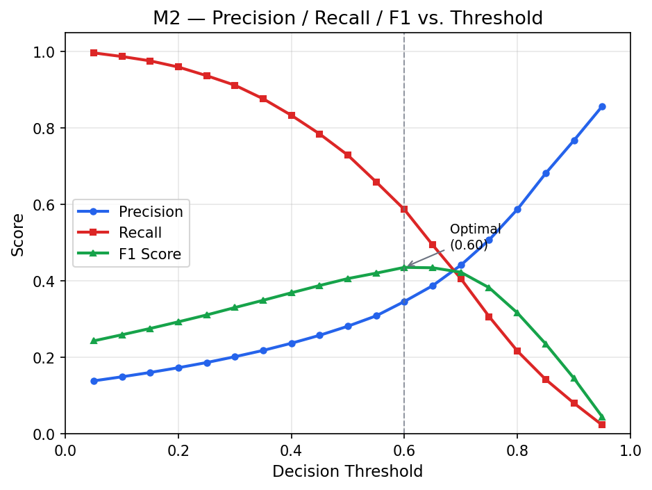
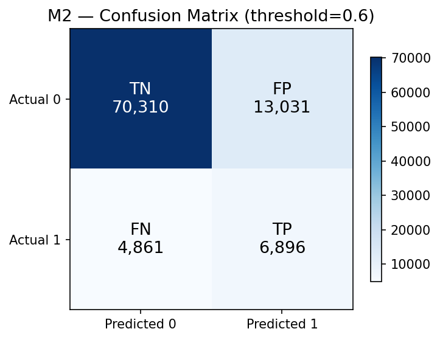
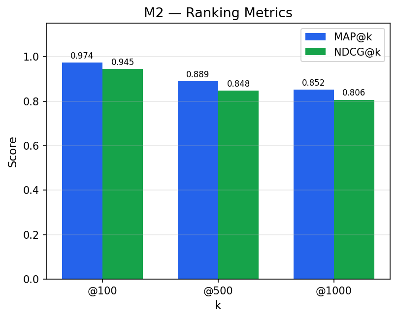
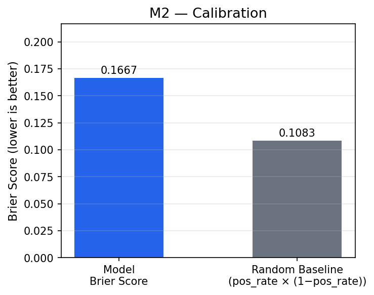
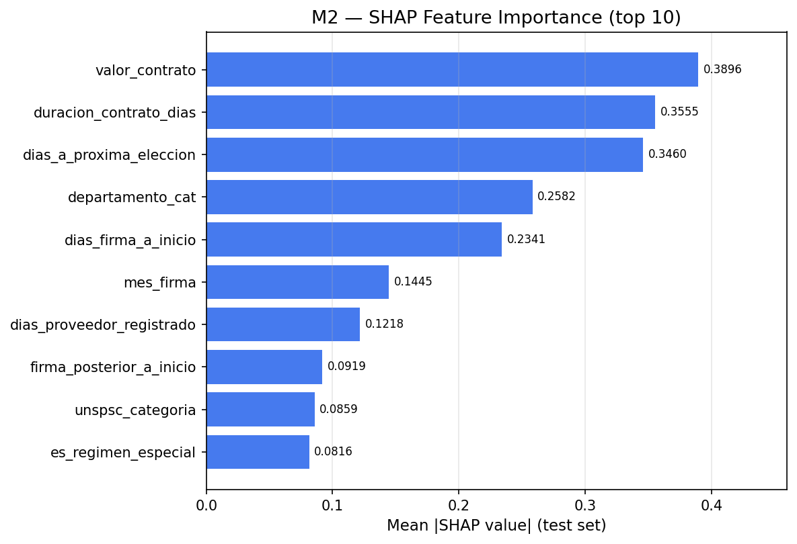

# Evaluation Report — Model M2

| Property | Value |
|----------|-------|
| Evaluation date | 2026-03-03T01:52:05.936248+00:00 |
| Test set size | 95,098 |
| Positives | 11,757 (12.36%) |
| Negatives | 83,341 (87.64%) |

---

## 1. Discrimination — ROC Curve

| Metric | Value |
|--------|-------|
| **AUC-ROC** | **0.8144** |

---

## 2. Score Distribution

---

## 3. Precision / Recall / F1 vs. Threshold

Threshold Analysis Table (click to expand)

| Threshold | Precision | Recall | F1 | TN | FP | FN | TP |
|:---------:|:---------:|:------:|:--:|---:|---:|---:|---:|
| 0.05 | 0.1384 | 0.9963 | 0.2430 | 10,392 | 72,949 | 43 | 11,714 |
| 0.10 | 0.1490 | 0.9869 | 0.2589 | 17,075 | 66,266 | 154 | 11,603 |
| 0.15 | 0.1603 | 0.9755 | 0.2754 | 23,280 | 60,061 | 288 | 11,469 |
| 0.20 | 0.1728 | 0.9593 | 0.2928 | 29,344 | 53,997 | 478 | 11,279 |
| 0.25 | 0.1863 | 0.9367 | 0.3108 | 35,242 | 48,099 | 744 | 11,013 |
| 0.30 | 0.2016 | 0.9118 | 0.3302 | 40,880 | 42,461 | 1,037 | 10,720 |
| 0.35 | 0.2180 | 0.8763 | 0.3492 | 46,385 | 36,956 | 1,454 | 10,303 |
| 0.40 | 0.2368 | 0.8330 | 0.3688 | 51,776 | 31,565 | 1,963 | 9,794 |
| 0.45 | 0.2576 | 0.7843 | 0.3878 | 56,763 | 26,578 | 2,536 | 9,221 |
| 0.50 | 0.2814 | 0.7287 | 0.4060 | 61,461 | 21,880 | 3,190 | 8,567 |
| 0.55 | 0.3084 | 0.6588 | 0.4201 | 65,971 | 17,370 | 4,011 | 7,746 |
| 0.60 **←** | 0.3461 | 0.5865 | 0.4353 | 70,310 | 13,031 | 4,861 | 6,896 |
| 0.65 | 0.3873 | 0.4939 | 0.4342 | 74,156 | 9,185 | 5,950 | 5,807 |
| 0.70 | 0.4411 | 0.4055 | 0.4226 | 77,302 | 6,039 | 6,990 | 4,767 |
| 0.75 | 0.5071 | 0.3065 | 0.3820 | 79,839 | 3,502 | 8,154 | 3,603 |
| 0.80 | 0.5872 | 0.2163 | 0.3161 | 81,553 | 1,788 | 9,214 | 2,543 |
| 0.85 | 0.6812 | 0.1421 | 0.2352 | 82,559 | 782 | 10,086 | 1,671 |
| 0.90 | 0.7673 | 0.0802 | 0.1452 | 83,055 | 286 | 10,814 | 943 |
| 0.95 | 0.8567 | 0.0229 | 0.0446 | 83,296 | 45 | 11,488 | 269 |

---

## 4. Optimal Threshold & Confusion Matrix

**Recommended operating point (F1-maximizing):** threshold = **0.6**

| Metric | Value |
|--------|------:|
| Threshold | 0.6 |
| Precision | 0.3461 |
| Recall | 0.5865 |
| F1 | 0.4353 |
| TN | 70,310 |
| FP | 13,031 |
| FN | 4,861 |
| TP | 6,896 |

---

## 5. Ranking Metrics

| Metric | Value |
|--------|------:|
| MAP@100 | 0.9735 |
| MAP@500 | 0.8892 |
| MAP@1000 | 0.8523 |
| NDCG@100 | 0.9446 |
| NDCG@500 | 0.8475 |
| NDCG@1000 | 0.8062 |

---

## 6. Calibration

| Metric | Value |
|--------|------:|
| Brier Score | 0.1667 |
| Brier Baseline (random) | 0.1083 |

> Lower Brier Score = better calibration. Baseline = positive_rate × (1 − positive_rate).

---

## 8. SHAP Feature Importance

Top features by mean absolute SHAP value (test set):

| Rank | Feature | Mean abs SHAP |
|-----:|--------|--------------:|
| 1 | valor_contrato | 0.389595 |
| 2 | duracion_contrato_dias | 0.355497 |
| 3 | dias_a_proxima_eleccion | 0.345990 |
| 4 | departamento_cat | 0.258232 |
| 5 | dias_firma_a_inicio | 0.234118 |
| 6 | mes_firma | 0.144515 |
| 7 | dias_proveedor_registrado | 0.121767 |
| 8 | firma_posterior_a_inicio | 0.091869 |
| 9 | unspsc_categoria | 0.085871 |
| 10 | es_regimen_especial | 0.081585 |

SHAP artifact (parquet): shap_M2.parquet

---

## 9. Training Context

**Imbalance strategy:** scale_pos_weight

**Best hyperparameters:**

| Parameter | Value |
|-----------|------:|
| colsample_bytree | 0.5079831261101071 |
| gamma | 0.1 |
| learning_rate | 0.1024932221692416 |
| max_depth | 6 |
| min_child_weight | 7 |
| n_estimators | 477 |
| reg_alpha | 0 |
| reg_lambda | 5 |
| subsample | 0.5866823267538861 |

---

*Report generated automatically by SIP Engine evaluation module.*  
*See companion JSON and CSV files for machine-readable data.*
