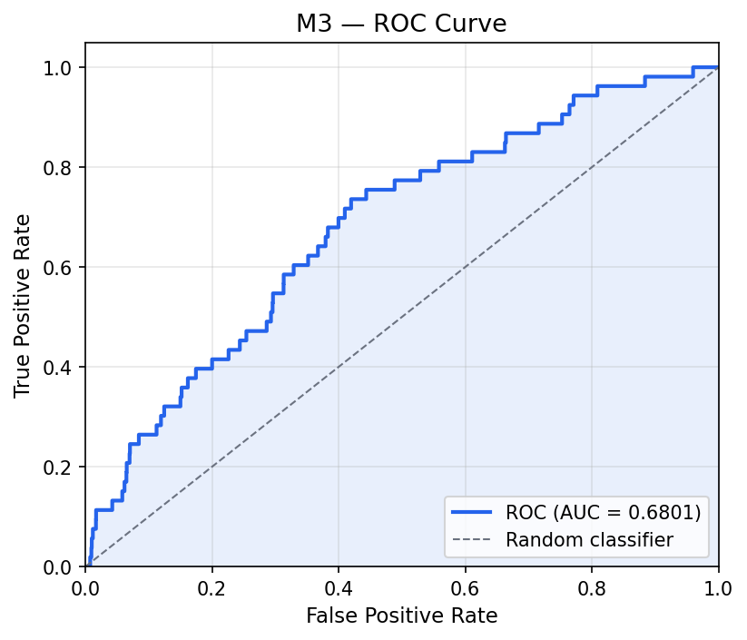
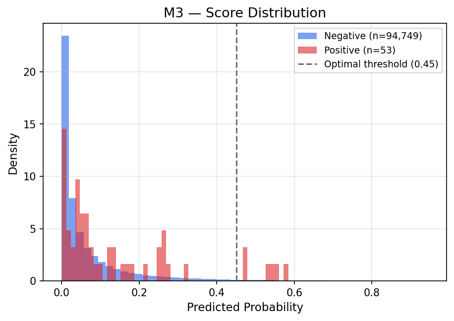
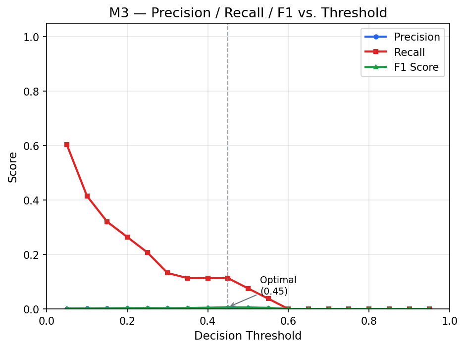
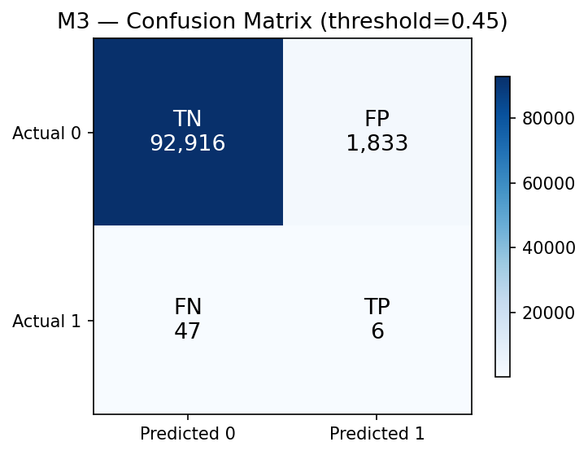
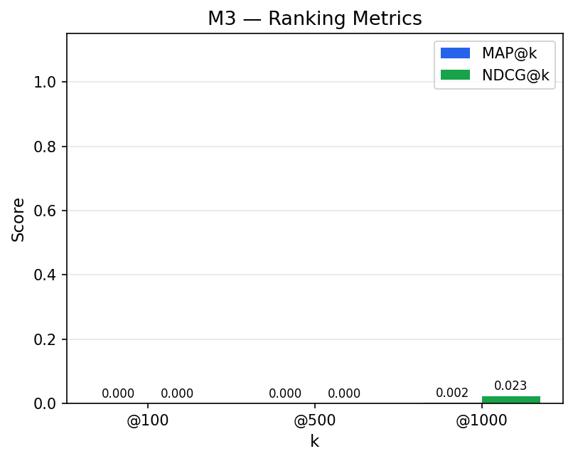
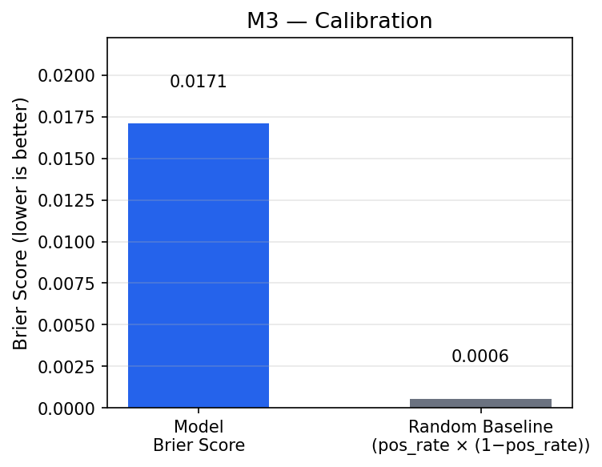

# Evaluation Report — Model M3

| Property | Value |
|----------|-------|
| Evaluation date | 2026-03-02T18:41:27.431561+00:00 |
| Test set size | 94,802 |
| Positives | 53 (0.06%) |
| Negatives | 94,749 (99.94%) |

---

## 1. Discrimination — ROC Curve

| Metric | Value |
|--------|-------|
| **AUC-ROC** | **0.7047** |

---

## 2. Score Distribution

---

## 3. Precision / Recall / F1 vs. Threshold

Threshold Analysis Table (click to expand)

| Threshold | Precision | Recall | F1 | TN | FP | FN | TP |
|:---------:|:---------:|:------:|:--:|---:|---:|---:|---:|
| 0.05 | 0.0006 | 1.0000 | 0.0011 | 1,314 | 93,435 | 0 | 53 |
| 0.10 | 0.0006 | 1.0000 | 0.0012 | 8,361 | 86,388 | 0 | 53 |
| 0.15 | 0.0007 | 0.8868 | 0.0014 | 28,287 | 66,462 | 6 | 47 |
| 0.20 | 0.0009 | 0.7358 | 0.0018 | 51,580 | 43,169 | 14 | 39 |
| 0.25 | 0.0011 | 0.5472 | 0.0022 | 68,316 | 26,433 | 24 | 29 |
| 0.30 | 0.0018 | 0.3396 | 0.0037 | 85,034 | 9,715 | 35 | 18 |
| 0.35 | 0.0026 | 0.1887 | 0.0052 | 90,963 | 3,786 | 43 | 10 |
| 0.40 | 0.0043 | 0.1132 | 0.0084 | 93,375 | 1,374 | 47 | 6 |
| 0.45 | 0.0059 | 0.0755 | 0.0110 | 94,078 | 671 | 49 | 4 |
| 0.50 | 0.0071 | 0.0566 | 0.0126 | 94,329 | 420 | 50 | 3 |
| 0.55 | 0.0073 | 0.0377 | 0.0122 | 94,477 | 272 | 51 | 2 |
| 0.60 **←** | 0.0118 | 0.0377 | 0.0179 | 94,581 | 168 | 51 | 2 |
| 0.65 | 0.0000 | 0.0000 | 0.0000 | 94,668 | 81 | 53 | 0 |
| 0.70 | 0.0000 | 0.0000 | 0.0000 | 94,724 | 25 | 53 | 0 |
| 0.75 | 0.0000 | 0.0000 | 0.0000 | 94,746 | 3 | 53 | 0 |
| 0.80 | 0.0000 | 0.0000 | 0.0000 | 94,749 | 0 | 53 | 0 |
| 0.85 | 0.0000 | 0.0000 | 0.0000 | 94,749 | 0 | 53 | 0 |
| 0.90 | 0.0000 | 0.0000 | 0.0000 | 94,749 | 0 | 53 | 0 |
| 0.95 | 0.0000 | 0.0000 | 0.0000 | 94,749 | 0 | 53 | 0 |

---

## 4. Optimal Threshold & Confusion Matrix

**Recommended operating point (F1-maximizing):** threshold = **0.6**

| Metric | Value |
|--------|------:|
| Threshold | 0.6 |
| Precision | 0.0118 |
| Recall | 0.0377 |
| F1 | 0.0179 |
| TN | 94,581 |
| FP | 168 |
| FN | 51 |
| TP | 2 |

---

## 5. Ranking Metrics

| Metric | Value |
|--------|------:|
| MAP@100 | 0.0000 |
| MAP@500 | 0.0099 |
| MAP@1000 | 0.0085 |
| NDCG@100 | 0.0000 |
| NDCG@500 | 0.0298 |
| NDCG@1000 | 0.0456 |

---

## 6. Calibration

| Metric | Value |
|--------|------:|
| Brier Score | 0.0474 |
| Brier Baseline (random) | 0.0006 |

> Lower Brier Score = better calibration. Baseline = positive_rate × (1 − positive_rate).

---

## 7. Training Context

**Imbalance strategy:** upsampling_25pct

**Best hyperparameters:**

| Parameter | Value |
|-----------|------:|
| colsample_bytree | 0.668807585701814 |
| gamma | 0.5 |
| learning_rate | 0.017725001286332035 |
| max_depth | 3 |
| min_child_weight | 4 |
| n_estimators | 162 |
| reg_alpha | 0.1 |
| reg_lambda | 0 |
| subsample | 0.6269577069671723 |

---

*Report generated automatically by SIP Engine evaluation module.*  
*See companion JSON and CSV files for machine-readable data.*
