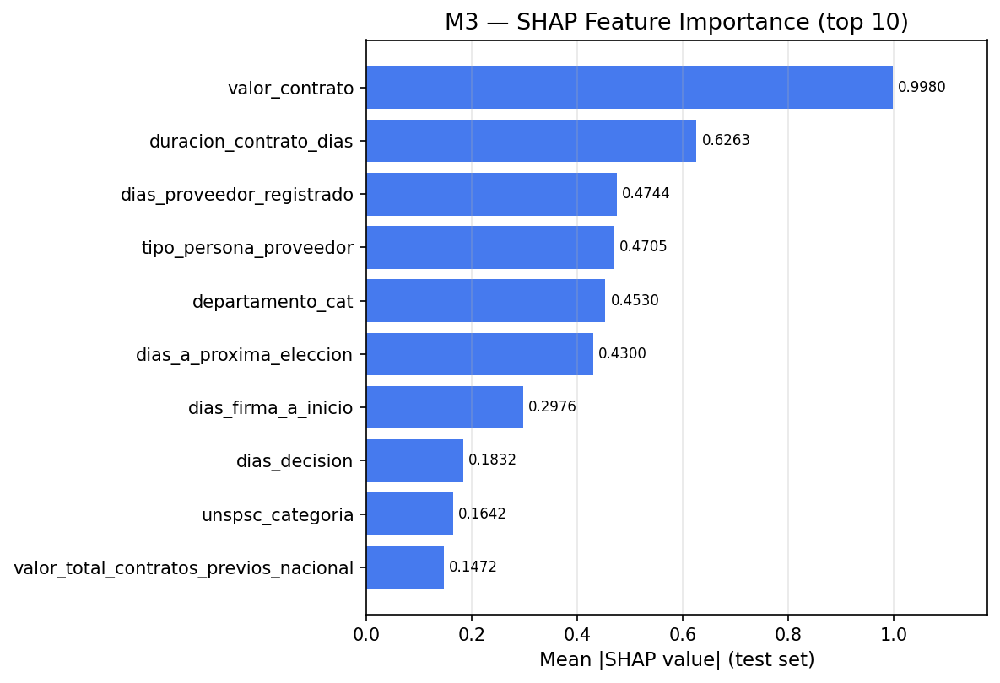

# Evaluation Report — Model M3

| Property | Value |
|----------|-------|
| Evaluation date | 2026-03-03T01:54:40.519134+00:00 |
| Test set size | 94,802 |
| Positives | 53 (0.06%) |
| Negatives | 94,749 (99.94%) |

---

## 1. Discrimination — ROC Curve

| Metric | Value |
|--------|-------|
| **AUC-ROC** | **0.6801** |

---

## 2. Score Distribution

---

## 3. Precision / Recall / F1 vs. Threshold

Threshold Analysis Table (click to expand)

| Threshold | Precision | Recall | F1 | TN | FP | FN | TP |
|:---------:|:---------:|:------:|:--:|---:|---:|---:|---:|
| 0.05 | 0.0010 | 0.6038 | 0.0019 | 61,952 | 32,797 | 21 | 32 |
| 0.10 | 0.0011 | 0.4151 | 0.0023 | 75,295 | 19,454 | 31 | 22 |
| 0.15 | 0.0013 | 0.3208 | 0.0026 | 81,919 | 12,830 | 36 | 17 |
| 0.20 | 0.0016 | 0.2642 | 0.0031 | 85,763 | 8,986 | 39 | 14 |
| 0.25 | 0.0017 | 0.2075 | 0.0033 | 88,241 | 6,508 | 42 | 11 |
| 0.30 | 0.0015 | 0.1321 | 0.0029 | 90,058 | 4,691 | 46 | 7 |
| 0.35 | 0.0018 | 0.1132 | 0.0035 | 91,334 | 3,415 | 47 | 6 |
| 0.40 | 0.0024 | 0.1132 | 0.0047 | 92,263 | 2,486 | 47 | 6 |
| 0.45 **←** | 0.0033 | 0.1132 | 0.0063 | 92,916 | 1,833 | 47 | 6 |
| 0.50 | 0.0030 | 0.0755 | 0.0058 | 93,419 | 1,330 | 49 | 4 |
| 0.55 | 0.0022 | 0.0377 | 0.0041 | 93,828 | 921 | 51 | 2 |
| 0.60 | 0.0000 | 0.0000 | 0.0000 | 94,137 | 612 | 53 | 0 |
| 0.65 | 0.0000 | 0.0000 | 0.0000 | 94,364 | 385 | 53 | 0 |
| 0.70 | 0.0000 | 0.0000 | 0.0000 | 94,505 | 244 | 53 | 0 |
| 0.75 | 0.0000 | 0.0000 | 0.0000 | 94,617 | 132 | 53 | 0 |
| 0.80 | 0.0000 | 0.0000 | 0.0000 | 94,678 | 71 | 53 | 0 |
| 0.85 | 0.0000 | 0.0000 | 0.0000 | 94,722 | 27 | 53 | 0 |
| 0.90 | 0.0000 | 0.0000 | 0.0000 | 94,739 | 10 | 53 | 0 |
| 0.95 | 0.0000 | 0.0000 | 0.0000 | 94,749 | 0 | 53 | 0 |

---

## 4. Optimal Threshold & Confusion Matrix

**Recommended operating point (F1-maximizing):** threshold = **0.45**

| Metric | Value |
|--------|------:|
| Threshold | 0.45 |
| Precision | 0.0033 |
| Recall | 0.1132 |
| F1 | 0.0063 |
| TN | 92,916 |
| FP | 1,833 |
| FN | 47 |
| TP | 6 |

---

## 5. Ranking Metrics

| Metric | Value |
|--------|------:|
| MAP@100 | 0.0000 |
| MAP@500 | 0.0000 |
| MAP@1000 | 0.0023 |
| NDCG@100 | 0.0000 |
| NDCG@500 | 0.0000 |
| NDCG@1000 | 0.0230 |

---

## 6. Calibration

| Metric | Value |
|--------|------:|
| Brier Score | 0.0171 |
| Brier Baseline (random) | 0.0006 |

> Lower Brier Score = better calibration. Baseline = positive_rate × (1 − positive_rate).

---

## 8. SHAP Feature Importance

Top features by mean absolute SHAP value (test set):

| Rank | Feature | Mean abs SHAP |
|-----:|--------|--------------:|
| 1 | valor_contrato | 0.997981 |
| 2 | duracion_contrato_dias | 0.626287 |
| 3 | dias_proveedor_registrado | 0.474361 |
| 4 | tipo_persona_proveedor | 0.470547 |
| 5 | departamento_cat | 0.453035 |
| 6 | dias_a_proxima_eleccion | 0.429987 |
| 7 | dias_firma_a_inicio | 0.297568 |
| 8 | dias_decision | 0.183238 |
| 9 | unspsc_categoria | 0.164216 |
| 10 | valor_total_contratos_previos_nacional | 0.147215 |

SHAP artifact (parquet): shap_M3.parquet

---

## 9. Training Context

**Imbalance strategy:** upsampling_25pct

**Best hyperparameters:**

| Parameter | Value |
|-----------|------:|
| colsample_bytree | 0.5826334695315012 |
| gamma | 0 |
| learning_rate | 0.28691395365453726 |
| max_depth | 3 |
| min_child_weight | 8 |
| n_estimators | 112 |
| reg_alpha | 1.0 |
| reg_lambda | 5 |
| subsample | 0.8534286719238086 |

---

*Report generated automatically by SIP Engine evaluation module.*  
*See companion JSON and CSV files for machine-readable data.*
