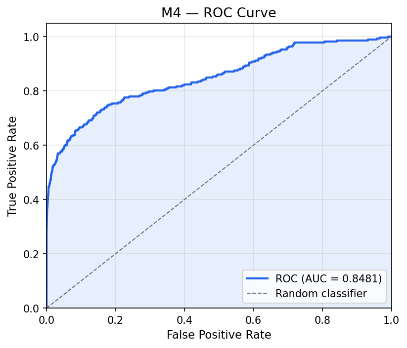
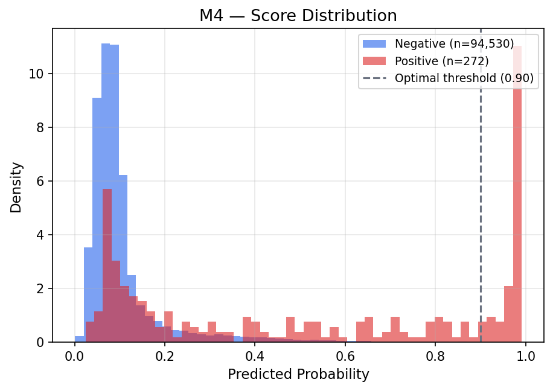
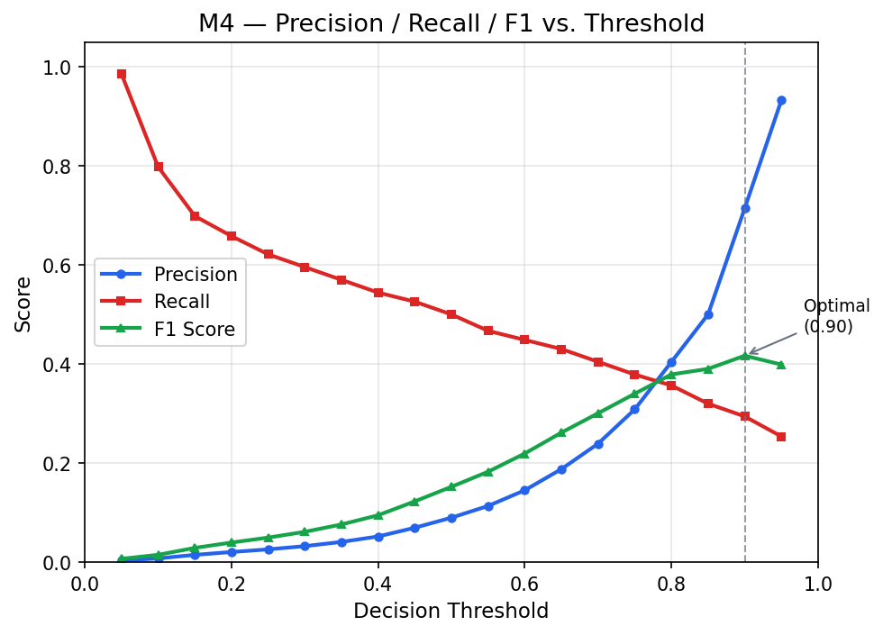
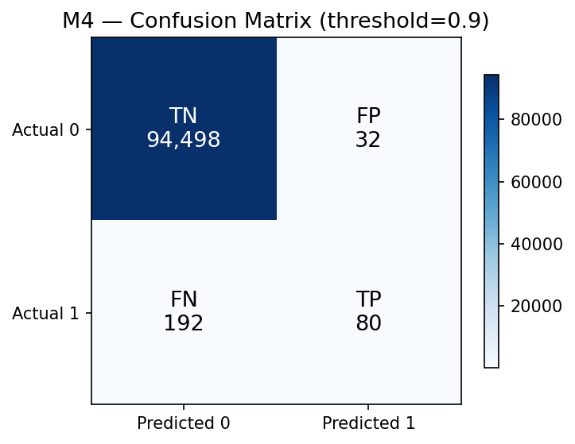
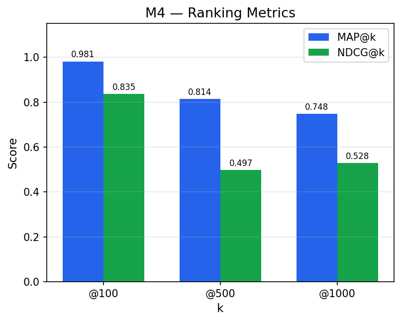
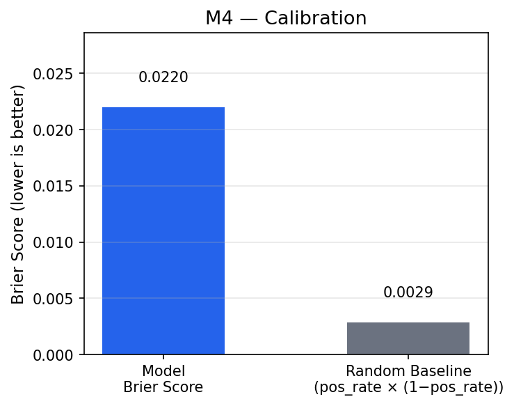
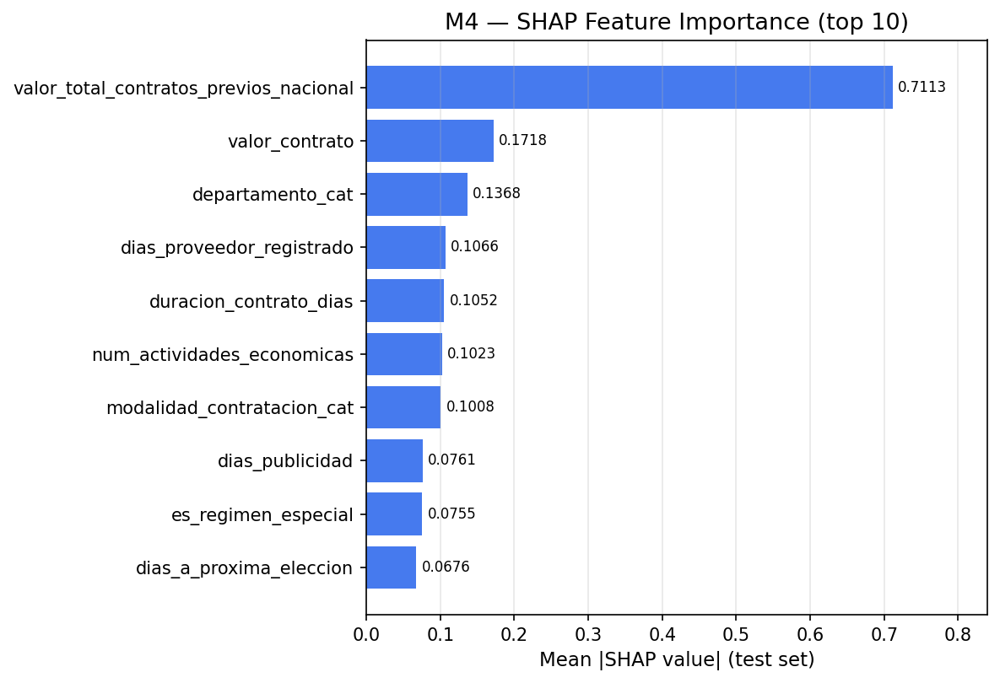

# Evaluation Report — Model M4

| Property | Value |
|----------|-------|
| Evaluation date | 2026-03-03T01:55:51.892129+00:00 |
| Test set size | 94,802 |
| Positives | 272 (0.29%) |
| Negatives | 94,530 (99.71%) |

---

## 1. Discrimination — ROC Curve

| Metric | Value |
|--------|-------|
| **AUC-ROC** | **0.8481** |

---

## 2. Score Distribution

---

## 3. Precision / Recall / F1 vs. Threshold

Threshold Analysis Table (click to expand)

| Threshold | Precision | Recall | F1 | TN | FP | FN | TP |
|:---------:|:---------:|:------:|:--:|---:|---:|---:|---:|
| 0.05 | 0.0033 | 0.9853 | 0.0067 | 14,782 | 79,748 | 4 | 268 |
| 0.10 | 0.0075 | 0.7978 | 0.0148 | 65,658 | 28,872 | 55 | 217 |
| 0.15 | 0.0147 | 0.6985 | 0.0287 | 81,766 | 12,764 | 82 | 190 |
| 0.20 | 0.0204 | 0.6581 | 0.0395 | 85,926 | 8,604 | 93 | 179 |
| 0.25 | 0.0258 | 0.6213 | 0.0495 | 88,140 | 6,390 | 103 | 169 |
| 0.30 | 0.0322 | 0.5956 | 0.0612 | 89,668 | 4,862 | 110 | 162 |
| 0.35 | 0.0407 | 0.5699 | 0.0761 | 90,881 | 3,649 | 117 | 155 |
| 0.40 | 0.0518 | 0.5441 | 0.0946 | 91,822 | 2,708 | 124 | 148 |
| 0.45 | 0.0694 | 0.5257 | 0.1226 | 92,613 | 1,917 | 129 | 143 |
| 0.50 | 0.0897 | 0.5000 | 0.1521 | 93,150 | 1,380 | 136 | 136 |
| 0.55 | 0.1134 | 0.4669 | 0.1825 | 93,537 | 993 | 145 | 127 |
| 0.60 | 0.1451 | 0.4485 | 0.2192 | 93,811 | 719 | 150 | 122 |
| 0.65 | 0.1878 | 0.4301 | 0.2615 | 94,024 | 506 | 155 | 117 |
| 0.70 | 0.2391 | 0.4044 | 0.3005 | 94,180 | 350 | 162 | 110 |
| 0.75 | 0.3084 | 0.3787 | 0.3399 | 94,299 | 231 | 169 | 103 |
| 0.80 | 0.4042 | 0.3566 | 0.3789 | 94,387 | 143 | 175 | 97 |
| 0.85 | 0.5000 | 0.3199 | 0.3901 | 94,443 | 87 | 185 | 87 |
| 0.90 **←** | 0.7143 | 0.2941 | 0.4167 | 94,498 | 32 | 192 | 80 |
| 0.95 | 0.9324 | 0.2537 | 0.3988 | 94,525 | 5 | 203 | 69 |

---

## 4. Optimal Threshold & Confusion Matrix

**Recommended operating point (F1-maximizing):** threshold = **0.9**

| Metric | Value |
|--------|------:|
| Threshold | 0.9 |
| Precision | 0.7143 |
| Recall | 0.2941 |
| F1 | 0.4167 |
| TN | 94,498 |
| FP | 32 |
| FN | 192 |
| TP | 80 |

---

## 5. Ranking Metrics

| Metric | Value |
|--------|------:|
| MAP@100 | 0.9807 |
| MAP@500 | 0.8144 |
| MAP@1000 | 0.7479 |
| NDCG@100 | 0.8355 |
| NDCG@500 | 0.4970 |
| NDCG@1000 | 0.5284 |

---

## 6. Calibration

| Metric | Value |
|--------|------:|
| Brier Score | 0.0220 |
| Brier Baseline (random) | 0.0029 |

> Lower Brier Score = better calibration. Baseline = positive_rate × (1 − positive_rate).

---

## 8. SHAP Feature Importance

Top features by mean absolute SHAP value (test set):

| Rank | Feature | Mean abs SHAP |
|-----:|--------|--------------:|
| 1 | valor_total_contratos_previos_nacional | 0.711349 |
| 2 | valor_contrato | 0.171821 |
| 3 | departamento_cat | 0.136750 |
| 4 | dias_proveedor_registrado | 0.106617 |
| 5 | duracion_contrato_dias | 0.105191 |
| 6 | num_actividades_economicas | 0.102325 |
| 7 | modalidad_contratacion_cat | 0.100807 |
| 8 | dias_publicidad | 0.076141 |
| 9 | es_regimen_especial | 0.075463 |
| 10 | dias_a_proxima_eleccion | 0.067571 |

SHAP artifact (parquet): shap_M4.parquet

---

## 9. Training Context

**Imbalance strategy:** upsampling_25pct

**Best hyperparameters:**

| Parameter | Value |
|-----------|------:|
| colsample_bytree | 0.8645035840204937 |
| gamma | 0 |
| learning_rate | 0.07853737079666878 |
| max_depth | 4 |
| min_child_weight | 7 |
| n_estimators | 90 |
| reg_alpha | 1.0 |
| reg_lambda | 0 |
| subsample | 0.811649063413779 |

---

*Report generated automatically by SIP Engine evaluation module.*  
*See companion JSON and CSV files for machine-readable data.*
